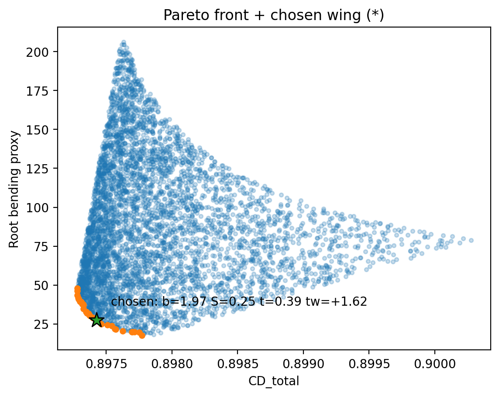
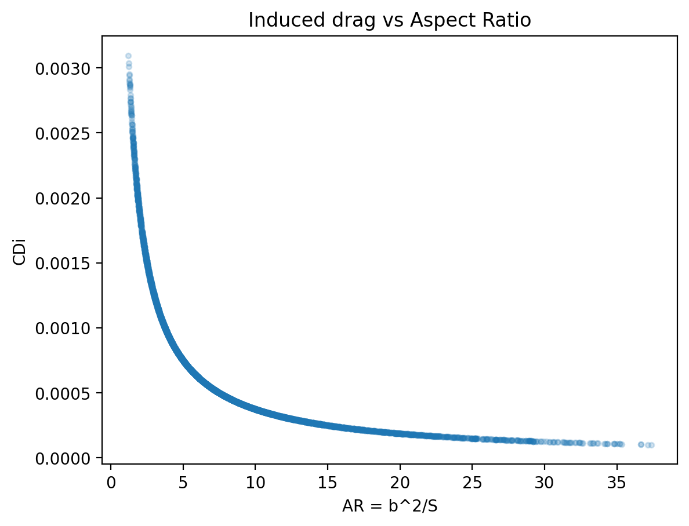

# WingParetoProject

Mini projet Python : on explore **plein de formes d’ailes** au hasard, on estime leur performance, puis on garde les meilleures sous forme d’un **front de Pareto** (compromis).

---

## Idée du projet (en mots simples)

Une aile, c’est un compromis :
- **moins de traînée (drag)** → avion plus efficace
- **moins d’efforts structurels** → aile plus légère / plus facile à construire

Ici on compare les designs d’aile avec 2 critères :

1) **CD_total** (à minimiser)  
   Traînée totale =  
   - **CD_prof** : traînée “profil” (vient du profil/airfoil via une polar)  
   - **CDi** : traînée induite (vient du fait de produire de la portance avec une aile finie)

2) **M_root** (à minimiser)  
   Un **proxy** du moment à l’emplanture (effort structurel).  
   Plus c’est grand → aile plus “chargée” structurellement.

On génère N ailes au hasard, on calcule `(CD_total, M_root)` pour chacune, puis on garde les points **non-dominés** : le **Pareto front**.

---

## C’est quoi une “polar” (airfoil polar) ?

Une **polar** est un tableau qui donne, pour un profil (airfoil), la relation entre :
- **CL** : coefficient de portance (lift)
- **CD** : coefficient de traînée (drag)

Donc la polar te dit :  
> “Si je veux une portance CL, la traînée profil associée est CD_prof”.

Dans ce projet, on lit un fichier de `data/raw/abiba/polars/` pour récupérer cette courbe et faire une interpolation.

> Remarque : si jamais aucun fichier n’est lisible, le code utilise une courbe “fallback” simple : `CD = CD0 + k*CL²`.

---

## Pourquoi générer des ailes si on a déjà des fichiers polars ?

Les fichiers **polars** décrivent **le profil 2D** (airfoil) : comment CL et CD_prof varient.

Mais une **aile 3D**, ce n’est pas juste le profil :
- **b** = envergure (span)
- **S** = surface
- **AR = b²/S** = aspect ratio (très important pour CDi)
- **taper** = effilement (ici on le génère mais on ne l’utilise pas encore dans les formules)
- **twist** = vrillage (ici on l’utilise juste comme petite correction sur CL)

Donc :
- la **polar** donne la partie “profil” (CD_prof),
- la **géométrie de l’aile** influence surtout la **traînée induite** (CDi) et les efforts (M_root).

---

## Figures (résultats)

### 1) Pareto front + chosen wing


- Tous les points bleus = tous les designs testés.
- Les points orange = le **front de Pareto** : aucun autre design n’est meilleur en **même temps** sur CD_total **et** M_root.
- L’étoile (*) = une aile “choisie” automatiquement : proche du coin “idéal” (faible CD_total et faible M_root).

### 2) Induced drag vs Aspect Ratio


- **AR = b²/S** : plus AR est grand (aile plus “longue et fine”), plus la traînée induite **baisse**.
- La courbe montre ce lien : quand AR augmente → **CDi diminue** (globalement).

---

## Comment le code fonctionne (résumé)

1) Charge une polar (CL, CD) depuis `data/raw/abiba/polars/`
2) Génère N designs au hasard : `b, S, taper, twist`
3) Calcule :
   - `AR = b²/S`
   - `CL_eff = CL_TGT + 0.01*twist` (puis clamp)
   - `CD_prof = interp(CL_eff)` à partir de la polar
   - `CDi = CL_eff² / (pi * AR * E)`
   - `CD_total = CD_prof + CDi`
   - `M_root ≈ (q*S*CL_eff) * b / 4`
4) Extrait le **Pareto front**
5) Choisit un point “équilibré”
6) Sauvegarde les figures dans `outputs/`

---

## Run (Windows / PowerShell)

```bash
pip install -r requirements.txt
python wing_pareto.py
